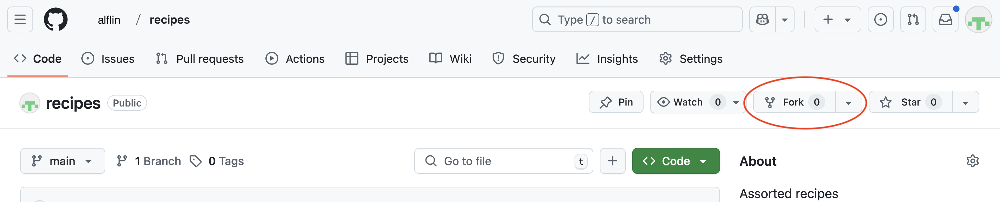
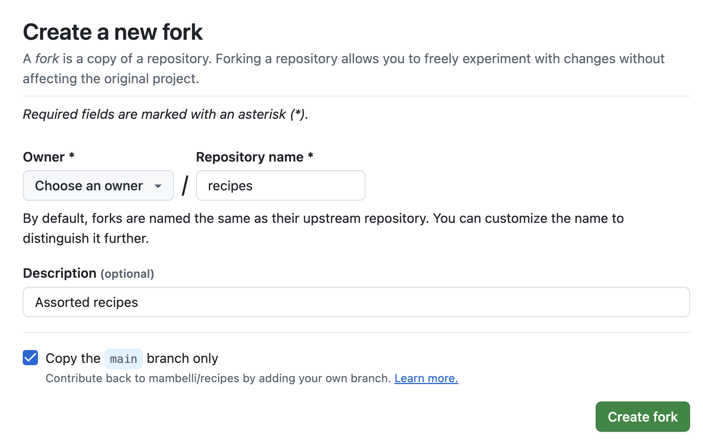

::::::::::::::::::::::::::::::::::::::: objectives

- Fork a repository
- Create a branch
- Push the branch to a repository fork
- Make a pull request to the original repository

::::::::::::::::::::::::::::::::::::::::::::::::::

:::::::::::::::::::::::::::::::::::::::: questions

- How can I use version control to collaborate with other people in a more effective and controlled way?

::::::::::::::::::::::::::::::::::::::::::::::::::


Often, we want to work on a set of changes that are more complicated than what was shown in the [colleborating episode](08-collab.md), and without affecting other people's work. Think for example, what would happen if I made a change to code that someone else was using, but left it in a broken state. They would probably not be very happy with me! To this effect, we can use a concept called 'branches' to separate works-in-progress from the known 'good' copy of the code. In general, it's considered good practice to create a branch for every piece of work that you do, and to merge these into the 'good' version regularly.

Also for the next step, like in the collaborating episodes, get into pairs.  
One person will be the "Owner", Alfredo Linguini (alflin) below, and the other
will be the "Collaborator", Tony Tagliatella (tontag) below.
The goal is that the Collaborator proposes changes into the Owner's repository.
You can switch roles at the end, so both persons will play Owner and Collaborator.

:::::::::::::::::::::::::::::::::::::::::  callout

## Practicing By Yourself

If you're working through this lesson on your own, you can carry on by opening
a second terminal window and, on a new browser window, creating a
[new GitHub organization](https://docs.github.com/en/organizations/collaborating-with-groups-in-organizations/creating-a-new-organization-from-scratch).
This terminal and browser windows will represent your partner, the "Collaborator",
working on another computer and using another GitHub account.
Your original terminal and browser window on GitHub will correspond to the "Owner".

::::::::::::::::::::::::::::::::::::::::::::::::::


## 1\. Forking a repository

Frequently you may not have write access to a Git repository or we may want to have more control on how the changes get merged in that repository.
So we create our own personal copy of the repository, linked to the original one.
This is called a 'forked' repository, frequently but not always it has the same name of the original repository.

To create a fork go on GitHub to the page of the repository you'd like to fork, e.g. `https://github.com/alflin/recipes`, then click on the 'fork' button, close to the top right of the window:
{alt='Fork a repository'}

A new page will let you choose the details of the fork:
- the owner, you or one of your organizations
- the name of the repository, by default the same as the forked repository (unless there is a conflict in your space)
{alt='Fork windows'}

Let's say you are Tony Tagliatella, 'tontag' on GitHub, and forked the repository maintaining the name ('recipes').
Now you can clone your personal copy (assuming you use CLI and HTTPS):

```bash
$ git clone https://github.com/tontag/recipes.git ~/Desktop/recipes
```

 If using SSH:

```bash
$ git clone git@github.com:tontag/recipes.git ~/Desktop/recipes

```

:::::::::::::::::::::::::::::::::::::::::  callout

## If You Are Practicing By Yourself

If you're working through this lesson on your own, you should have 
created the new GitHub organization as explained in the callout above,
and you should use that one for the forked repository.
Then, the clone command should use that forked repository and be in
the "Collaborator" terminal.

::::::::::::::::::::::::::::::::::::::::::::::::::

## 2\. Creating a new branch with changes

To create a new branch, run the following command in your repository:
 
```bash
$ git checkout -b add-tagliatelle-butter-sage
```
```output
Switched to a new branch 'add-tagliatelle-butter-sage'
```

This creates a separate area for us to work in and add changes. It's a bit like how we cloned the repository in a separate place in the last lesson. However, we can also push our branch to the remote repository and keep it backed up.

We'll add a recipe to prepare tagliatelle with butter and sage. In the `tagliatelle.md` file:
```bash
$ nano tagliatelle.md
$ cat tagliatelle.md
```
```output
# Tagliatelle with butter and sage
## Ingredients
* 200 gr tagliatelle
* 80 gr butter
* sage
* salt
## Instructions
* Boil the water and add salt
* Cook the tagliatelle until al dente
* In the mean time melt the butter in a pan and add the sage
* Add the tagliatelle in the pan and mix
* Serve warm
```

Then we'll commit it as normal:
```bash
$ git add tagliatelle.md
$ git commit -m "Add a taglitelle recipe"
```
```output
[add-tagliatelle-butter-sage ea4141e] Add a taglitelle recipe
 1 file changed, 12 insertions(+)
```

Notice now that instead of saying 'main' here, it says 'add-tagliatelle-butter-sage', showing us that our commit is on the new branch. We've sort of glossed over it previously, but 'main' is the "default branch" in Git. In some older git versions this was named 'master', so you may see that instead.

Our commit is now saved in our local repository. If you want to, you can switch back to the 'main' branch by doing:

```bash
git checkout main
```
```output
Switched to branch 'main'
```

If you now check the files, you'll see that our new recipe isn't there:

```bash
ls tagliatelle.md
```
```output
ls: tagliatelle.md: No such file or directory
```

## 3\. Pushing a new branch

We'll switch back to our branch again:
```bash
$ git checkout add-tagliatelle-butter-sage
```
```output
Switched to branch 'add-tagliatelle-butter-sage'
```

We can put our changes onto GitHub by pushing it. However, if you run `git push`, it won't immediately work:

```bash
$ git push
```
```output
fatal: The current branch add-tagliatelle-butter-sage has no upstream branch.
To push the current branch and set the remote as upstream, use

    git push --set-upstream origin add-tagliatelle-butter-sage
```

This message just means that the remote doesn't have a branch *linked to* add-tagliatelle-butter-sage to push our work to. We can create one in our push just by running the command it gives us:

```bash
$ git push --set-upstream origin add-tagliatelle-butter-sage
```
```output
Enumerating objects: 4, done.
Counting objects: 100% (4/4), done.
Delta compression using up to 16 threads
Compressing objects: 100% (3/3), done.
Writing objects: 100% (3/3), 481 bytes | 481.00 KiB/s, done.
Total 3 (delta 0), reused 0 (delta 0), pack-reused 0 (from 0)
remote:
remote: Create a pull request for 'add-tagliatelle-butter-sage' on GitHub by visiting:
remote:      https://github.com/tontag/recipes/pull/new/add-tagliatelle-butter-sage
remote:
To https://github.com/tontag/recipes.git
 * [new branch]      add-tagliatelle-butter-sage -> add-tagliatelle-butter-sage
branch 'add-tagliatelle-butter-sage' set up to track 'origin/add-tagliatelle-butter-sage'.
```

This slightly convoluted message tells us that:
 
- A new branch was created on the remote GitHub version of the repository
- Our local copy is associated with the remote branch
- We pushed that commit
- We can easily create a pull request following the link provided
- Our repository is a fork of another repository and the changes can be fed upstream by opening a Pull Request (see the next section)

New changes can be added and then pushed to the branch just by running the standard commit and push commands now. It's worth noting that `git push` only applies to the branch that you are currently working on - if you make changes on "main", then switch to the "add-tagliatelle-butter-sage" and run `git push`, the main changes will not be uploaded to GitHub.

On GitHub, you can switch branches by using the little drop down menu:
{alt='Switch branch'}

:::::::::::::::::::::::::::::::::::::::::  callout

## Add branch protection rules (requirements) in the base repository

To avoid undesired changes in the base repository usually administrators will add restrictions, e.g.:

- Block regular merges (not using a pull request)
- Require at least one review before a Pull Request can be merged
- Require to pass [automated CI tests](15-python-project-and-testing.md#github-ci-unit-tests-and-linting) to pass before merging

To set these requirements go to the original repository, the "Owner"'s one, and in the "Settings" tab (the last on the right) select "Branches" from the menu on the left and under "Branch protection rules" you can press "Add rule" to add a new one or you can edit existing ones. Either ways you can click on the restrictions you'd like to enable.

::::::::::::::::::::::::::::::::::::::::::::::::::

## 4\. Pull Requests (Merging your contributions)

Pull requests can be used at this point to put the changes on the 'main' copy of the repository.

The easiest way to open a pull request is to use the URL suggested by Git, like 
` https://github.com/tontag/recipes/pull/new/add-tagliatelle-butter-sage` at the end of the previos section.
Alternatively, go back to your personal repository on GitHub and since it is the result of a fork, 
it will have a pull-down "Contribute" that allows to "Open pull request":
{alt='Contribute (PR) menu'}

Either way you'll get to a window where you can review and create the pull request.
The dialogue is pre-populated probably with the correct values, anyway you can use dropboxes 
pick the source and destination repository and branch, and a title and description
(similar to the comments in the Git commits). 
There are quite a few options. You should generally write a description that tells you what the changes are. If you are working on a project with other people, 'Assignees' are people who will be implementing changes (i.e. you) and reviewers are people who will check your work for any mistakes, code that could be written more elegantly, etc. - it is very good practice to get your code reviewed before merging and a GitHub project can also require that. 
Finally you can compare the content and open the pull request:
{alt='Contribute (PR) dialog'}

The Pull Request will be open in the base repository and you and the project members will be able to have a conversation about the changes you submitted.
There are 4 tabs in a Pull Request page:
- Conversation, summarizes the interactions and allows communications between the submitter and reviewers
- Commits, a list of Git commits included in this PR
- Checks, the result of automatic tests
- Files changed, a diff between the upstream branch and the one with the changes. This is the tab that can be used to comment the code/content and to ask for changes or approve the code.

A reviewer can highlight lines on the "Files changed" tab and add comments to request changes.
General comments can be added directly in the "Conversation" tab.

A reviewer could also edit a file directly in the PR (i.e. in the branch that will be merged in the repository (the submitter can block this if desired).
GitHub allows to edit files and commit changes directly on the Web. Convenient if the changes are small.

Finally, when the files are ready a reviewer can approve the PR.

At this point someone with write permission on the repository can merge the PR.
There are three options:
- Create a merge commit: Preserves the original history of all commits.
- Squash and merge: Useful if the PR has many commits not so meaningful. Remember to write a commit message capturing all the changes
- Rebase and merge: The most common if the PR branch was not shared or the base of other branches; adds all the commits on top after a rebase

Choose the most appropriate and complete the merge.
Frequently GitHub will ask to confirm the merge action.

At this point the changes have been incorporated in the destination branch, in the original repository. 
You can verify that inspecting the files.

The source branch of the PR can be deleted.

## 5\. Keeping up with upstream changes

Assuming that you are working on a project with many other collaborators, the main repository
will change frequently.

To keep your fork in sync, GitHub has a "Sync fork" pull-down in the status bar before your code (the same one where the contribute pull-down is).
In it, there is a green "Update branch" button that allows you to rebase your code to the upstream content. 
Then you can push updated local copies.
This process is fairly straight forward, especially if you keep your main/master branch as a mirror of the upstream one and do all your contributions in separate feature branches.

Alternatively, you cn manage both your fork and the upstream repo as remotes in a local clone and manually pull and rebase as desired. This gives you more control but may be more complex.

:::::::::::::::::::::::::::::::::::::::  challenge

## Switch Roles and Repeat

Switch roles and repeat the whole process.


::::::::::::::::::::::::::::::::::::::::::::::::::

:::::::::::::::::::::::::::::::::::::::  challenge

## Review Upstream Changes

The Owner pushed commits to the repository without giving any information
to the Collaborator. How can the Collaborator find out what has changed with
command line? And on GitHub?

:::::::::::::::  solution

## Solution

On the command line, the Collaborator can use `git fetch upstream main`
to get the remote changes into the local repository, but without merging
them. Then by running `git diff main upstream/main` the Collaborator
will see the changes output in the terminal.

On GitHub, the Collaborator can go to the repository and click on
the little triangle next to the "Sync fork" button to see if there have
been updates in the upstream repository.
Clicking on the upstream repository name after "forked from" under the
repository name will send you to the upstream repository where you can
check recent commits.


:::::::::::::::::::::::::

::::::::::::::::::::::::::::::::::::::::::::::::::

:::::::::::::::::::::::::::::::::::::::  challenge

## Comment Changes in GitHub

The Owner has some questions about one line change made by the Collaborator and
has some suggestions to propose.

With GitHub Pull Requests, it is possible to add general comments in the "Conversation"
tab of the pull request, and code specific comments on the diff in the "Files changed" tab. 
Over the line of code to comment, a blue comment icon appears to open a comment window.

The Owner posts her comments and suggestions using the GitHub interface.
The Owner can approve the changes proposed in the PR or can request code changes.


::::::::::::::::::::::::::::::::::::::::::::::::::

:::::::::::::::::::::::::::::::::::::::: keypoints

- `git checkout -b branchname` creates a branch where you can work on a set of changes
- `git checkout branchname` switches between branches
- Creating pull requests is the way most people work with Git and is good practice: it allows for more control
- Before pull requests can be merged, there must be no merge conflicts

::::::::::::::::::::::::::::::::::::::::::::::::::


